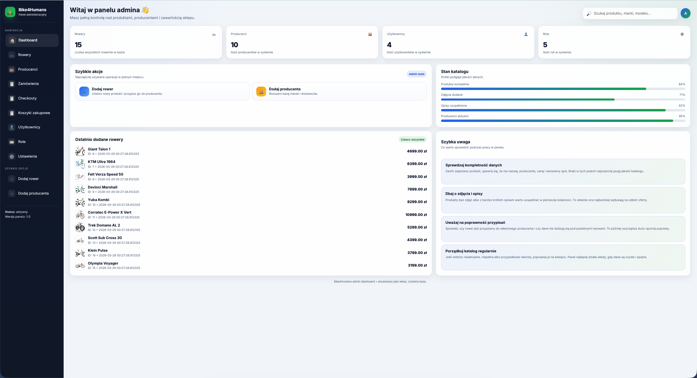
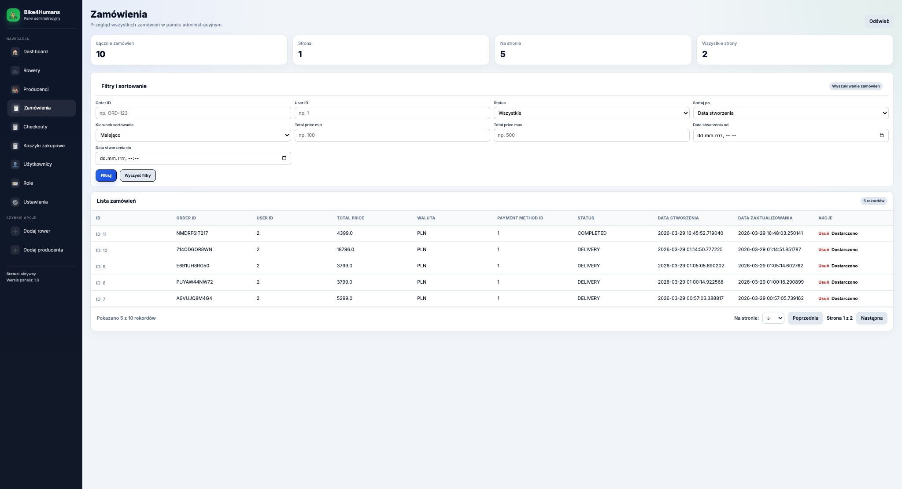
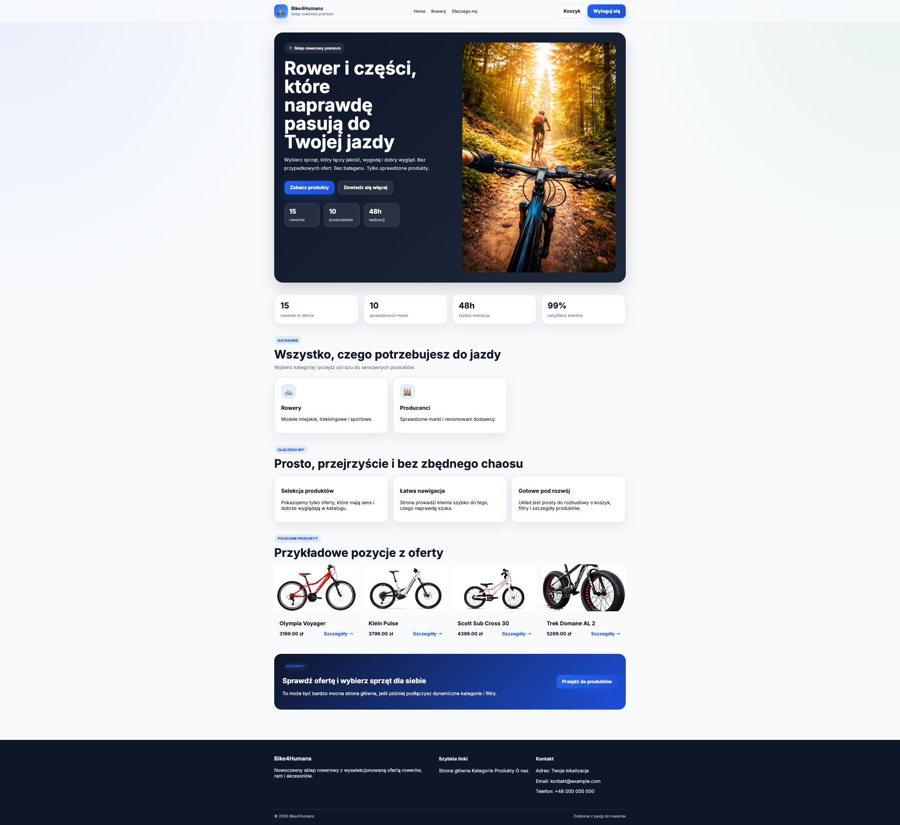
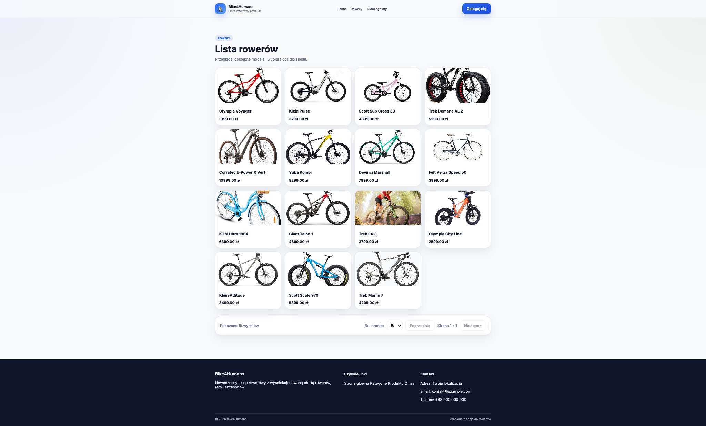
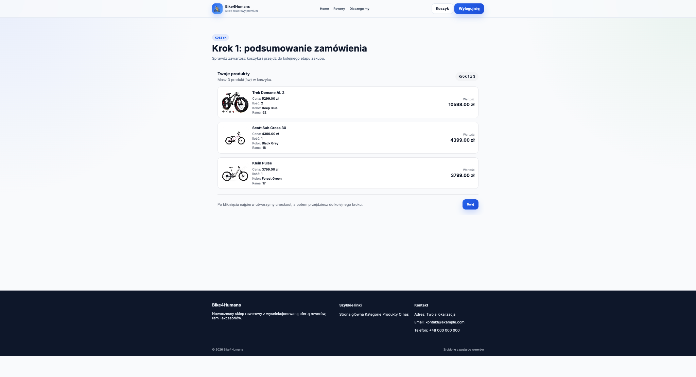
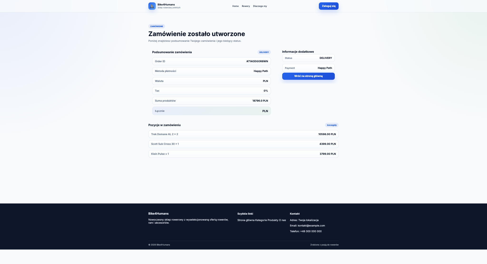

# 🚴 Bike Shop API

Backend for an online bike and accessories store, built with **Python and FastAPI**.  
This project was created as a practical portfolio piece to demonstrate skills in **backend development**, API design, data modeling, modular application architecture, and a simple server-rendered frontend.

The application combines:
- **REST API / backend**
- **admin panel**
- **authentication flow**
- **shopping cart / checkout flow**
- **orders with custom `order_id`**
- **payment provider**
- **simple Jinja-based frontend**
- **layered architecture** with clear separation of `routers`, `services`, `repositories`, `schemas`, and `models`

Admin panel:

Admin panel -> Orders (filters/ sort by):

Homepage:

Bikes:

Shopping cart:

Order page:

---

## 🛠 Technologies

- **Backend:** Python + FastAPI
- **Database:** SQLite / relational database layer via SQLAlchemy
- **ORM:** SQLAlchemy
- **Migrations:** Alembic
- **Validation / DTOs:** Pydantic
- **Testing:** pytest
- **Server:** Uvicorn
- **Frontend for basic UI:** Jinja templates
- **Styling:** CSS, Bootstrap
- **Development environment:** local virtual environment

---

## ✨ Highlights

- **Dedicated admin panel** for managing bikes, manufacturers, users, carts, checkouts, and orders
- **Authentication-based frontend flow** with login/logout state handling
- **Shopping cart and checkout flow** for logged-in users
- **Order creation with custom `order_id`**
- **Admin order list with filtering and sorting**
- **Payment provider step** simulating payment status changes
- **Modular architecture** with clear separation of concerns
- **DTO-based admin workflows** with request/response schemas
- **Data validation** powered by Pydantic
- **Database migrations** handled with Alembic
- **Seeded starter data** for easier development and testing
- **Simple frontend** for presenting store content and validating functionality
- **Clean project structure** designed for easy extension
- **Shared `BaseModel`** for common ORM fields like `id`, `created_at`, and `updated_at`

---

## 🔐 Authentication & User Flow

The application includes a simple frontend authentication flow:
- users can **log in** and **log out**
- the UI adapts depending on whether the user is authenticated
- the header can show:
  - **Zaloguj się** for anonymous users
  - **Wyloguj się** for authenticated users
  - **Koszyk** or **Checkout** depending on the user’s current state

---

## 🛒 Cart, Checkout & Orders

The store flow is built around a few steps:
1. **Cart step** — user reviews items in the cart
2. **Checkout step** — user confirms checkout details and payment method
3. **Payment provider step** — simulated payment confirmation/cancel/error
4. **Order creation** — order is created with a generated `order_id`

Orders now use a custom business identifier:
- `order_id` is a short random string
- it is intended to be human-friendly and suitable for display in URLs and views

The admin order list supports:
- filtering by `order_id`
- filtering by `user_id`
- filtering by `status`
- filtering by `total_price` range
- filtering by `created_at` range
- sorting by `created_at` or `status`
---

## 🛠 Technologies

- **Backend:** Python + FastAPI
- **Database:** SQLite
- **ORM:** SQLAlchemy
- **Migrations:** Alembic
- **Validation / DTOs:** Pydantic
- **Testing:** pytest
- **Server:** Uvicorn
- **Frontend for basic UI:** Jinja templates
- **Styling:** CSS, Bootstrap
- **Development environment:** local virtual environment
---

## 🔑 Features

### Admin area
- Manage **bikes**, **manufacturers**, **users**, **orders**, **checkouts**, and **carts**
- Full CRUD operations: **create / read / update / delete**
- Separate views, forms, and DTOs for admin workflows
- List, details, edit, and create pages for records
- Clear separation between HTTP handling and business logic

### Frontend
- Public homepage with product presentation
- Authentication-aware header with login/logout state
- Shopping cart pages
- Checkout pages
- Payment provider page
- Order summary / order flow handling
- Basic layout with templates and reusable components
- Static assets for styling and images

### Additional Components
- Data validation with Pydantic
- Layered structure:
  - `routers` — HTTP layer
  - `services` — business logic
  - `repositories` — database access layer
  - `schemas` — input/output DTOs
  - `models` — ORM entities
- Shared ORM base model for common columns
- Database schema evolution through Alembic migrations
- Structure ready for additional features without mixing responsibilities

---

## 🗂 Project Structure

- `app/`
  - `main.py` — application entrypoint
  - `database/` — database connection setup
  - `models/` — ORM models for bikes, manufacturers, users, carts, checkouts, orders, and payment methods
  - `repositories/` — database access layer
  - `routers/` — route definitions
    - `admin/` — admin endpoints
    - `front/` — public-facing endpoints
    - `render_pages/` — server-rendered pages
  - `schemas/` — Pydantic schemas
    - `admin/` — DTOs for admin operations
    - `front/` — DTOs for public views
  - `services/` — business logic
    - `admin/` — admin-related services
    - `auth/` — authentication utilities
    - `front/` — frontend-related services
  - `templates/` — Jinja templates
    - `admin/`
    - `authentication/`
    - `front/`
  - `static/` — CSS, JS, and images
    - `css/`
    - `images/`
    - `js/`
  - `core/` — shared project utilities
- `alembic/` — database migrations
- `tests/` — automated tests
- `app.db` — local development database
- `README.md` — readme file
- `requirements.txt` — required libs

---

## 🗃 Database & Migrations

The project uses **SQLite** and **Alembic** for schema migrations.  
The repository includes migrations for:
- the initial database schema
- default roles
- default users
- default manufacturers
- default bikes
- payment methods
- checkout/order-related changes
- custom `order_id` support for orders

This makes it easier to run the project locally and keep the database structure consistent.

---

## 🎯 Learning / Portfolio Goals

- Backend development with FastAPI
- REST API design
- Data modeling with SQLAlchemy
- Layered application architecture
- Separating business logic from HTTP handling
- Using Jinja templates for a simple UI
- Building a project that looks strong in a portfolio and is easy to extend
- Practicing filtering, sorting, and admin data management patterns
- Expand automated tests

---

## 📌 Possible Next Improvements in next repositories
- Add Docker-based deployment
- Add AI logic / RAG features