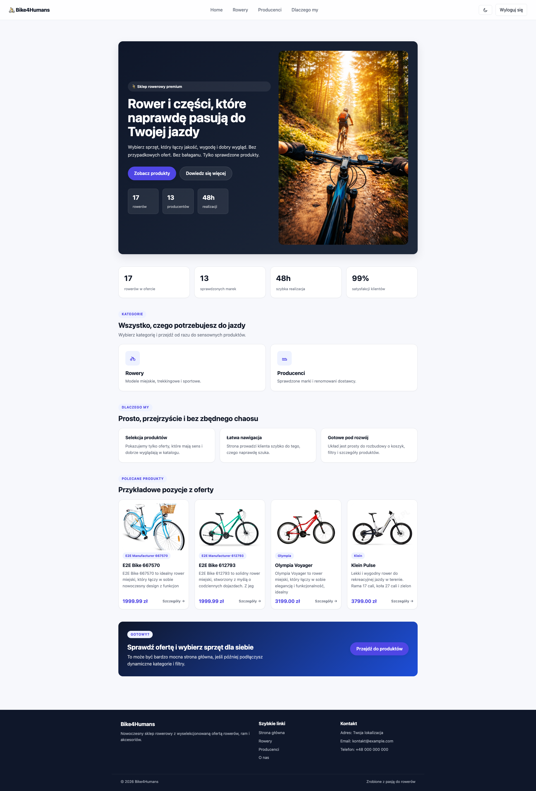
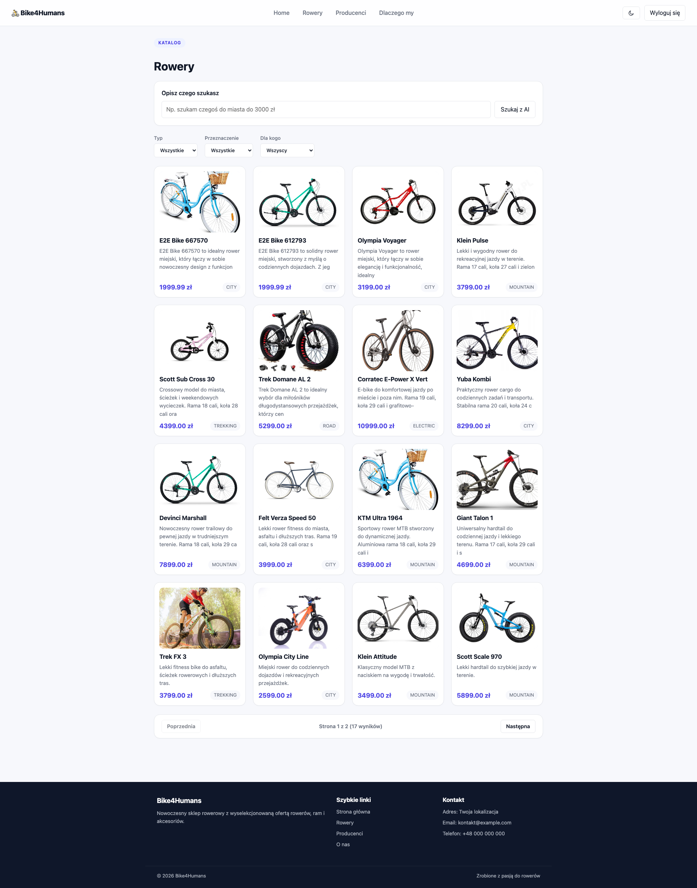
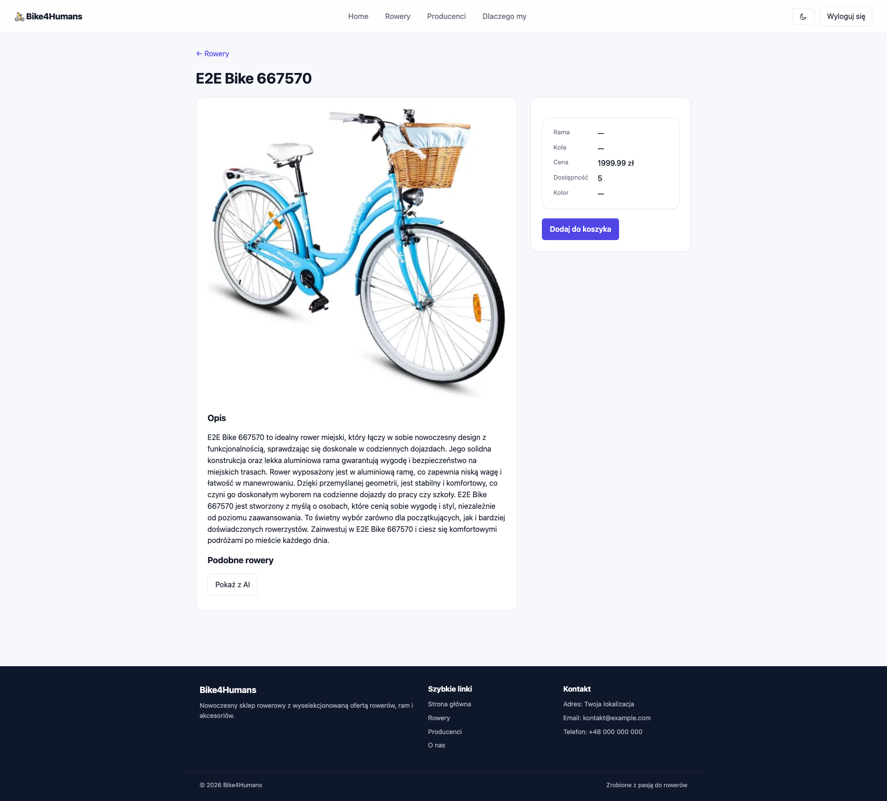
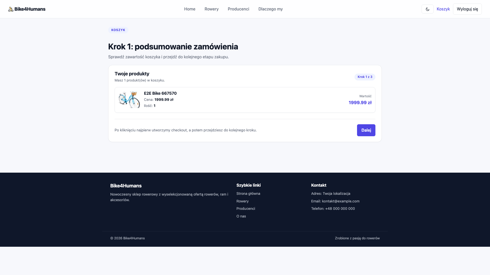
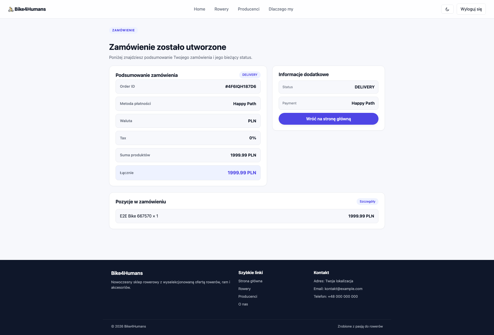
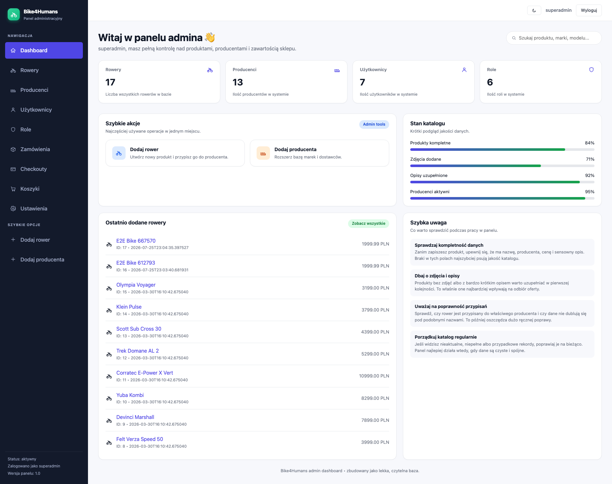
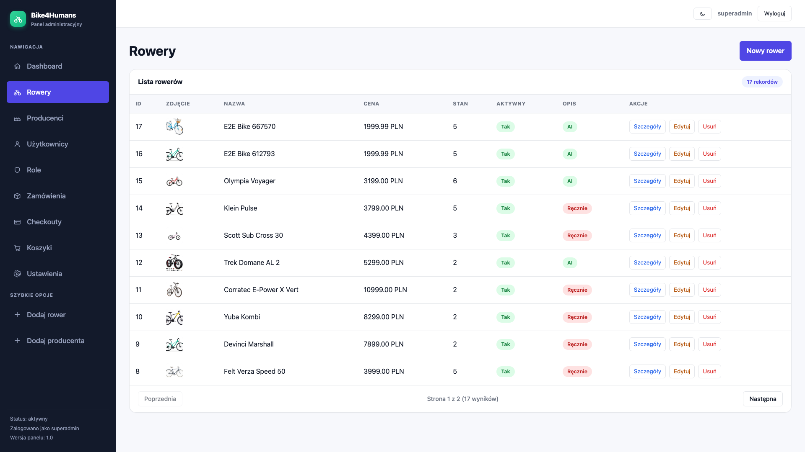
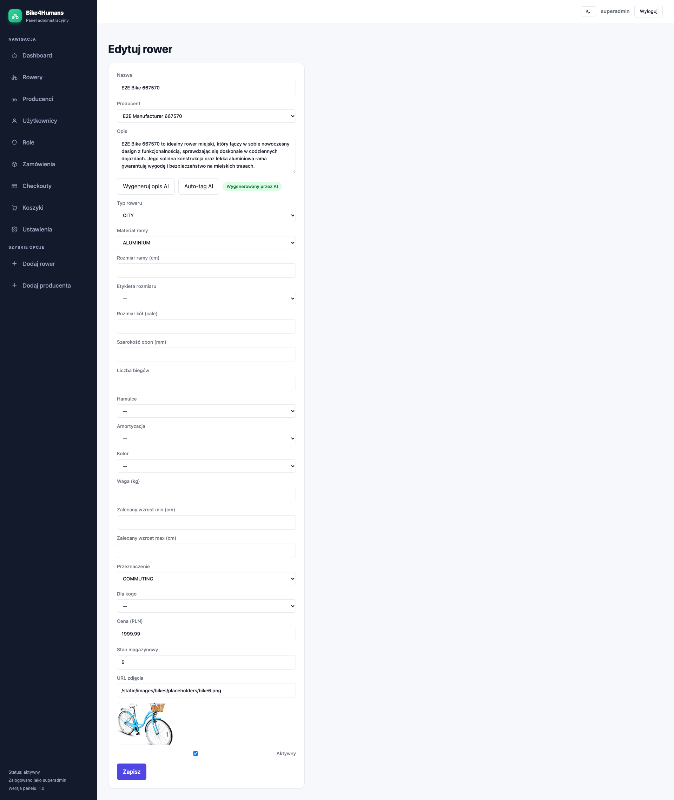
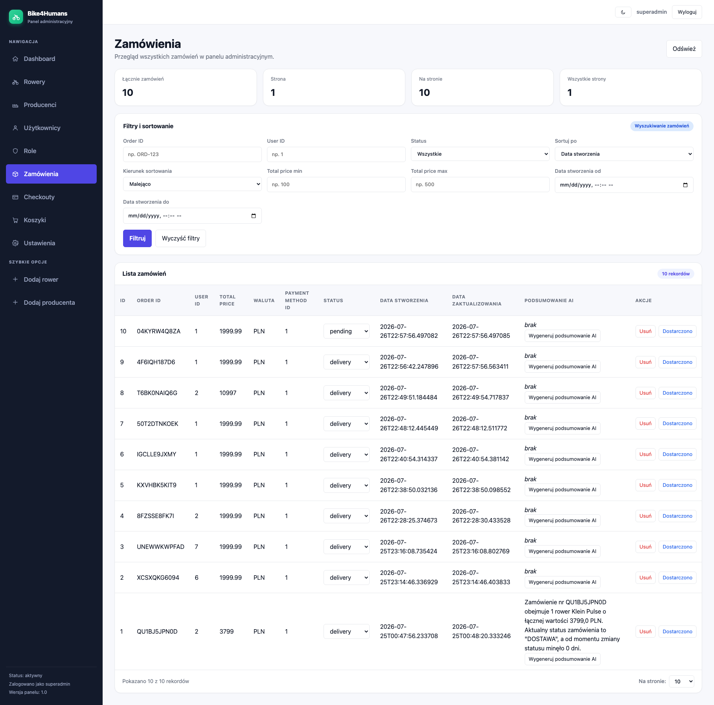

# 🚴 Bike Shop API

Backend for an online bike store built with **Python** and **FastAPI**.

This project started as a 1:1 copy of my previous repository -> https://github.com/berNy92k/Bike4HumansWebApp_DB, but it has since been developed further in a more focused direction:
adding **AI-based content generation** across the admin panel and storefront, and migrating the frontend from server-rendered Jinja pages to a React (Vite + TypeScript) SPA.

The application combines:
- **REST API / backend**
- **admin panel**
- **authentication flow**
- **shopping cart / checkout flow**
- **orders with custom `order_id`**
- **payment provider integration**
- **React (Vite + TypeScript) frontend**
- **layered architecture** with clear separation of `routers`, `services`, `repositories`, `schemas`, and `models`

---

## ✨ Current direction

The main idea behind this repository is to extend the existing bike shop with AI-assisted features.

Implemented AI use cases:
- generating **product descriptions for bikes and manufacturers**
- **auto-tagging** bike attributes (type, frame material, brakes, ...) from a free-text description, constrained
  to valid values via OpenAI structured outputs
- **natural-language search** for bikes (e.g. "something for the city under 3000 zl") mapped to real filters
- **"similar bikes" recommendations** on the storefront, cached per bike after the first AI call
- **AI-generated summaries** for admin orders, checkouts, and carts, to help staff scan records without reading
  the raw table

This means the project is no longer just a standard shop backend — it has become a base for experimenting with **AI in e-commerce administration**, covering every admin section where AI content genuinely adds value (users were deliberately left out — there's no descriptive data to generate from).

---

## 🛠 Technologies

- **Backend:** Python + FastAPI
- **Database:** SQLite / relational database layer via SQLAlchemy
- **ORM:** SQLAlchemy
- **Migrations:** Alembic
- **Validation / DTOs:** Pydantic
- **Auth:** JWT (`python-jose`), password hashing with `passlib`/`bcrypt`
- **AI:** OpenAI API (GPT models, structured outputs for constrained/typed responses)
- **Testing:** pytest
- **Server:** Uvicorn
- **Frontend:** React 19 + TypeScript (Vite), React Router
- **Styling:** plain CSS (custom properties / design tokens, no UI framework)
- **Containerization:** Docker + Docker Compose (multi-stage build: frontend build stage feeds the FastAPI image)
- **Development environment:** local virtual environment

---

## 📸 Screenshots

### Storefront

Homepage:


Bikes catalog, with AI natural-language search and filters:


Bike details, with an AI-generated description and AI "similar bikes" recommendations:


Shopping cart:


Order confirmation:


### Admin panel

Dashboard:


Bikes list, showing AI-generated vs. manually written descriptions:


Bike edit form, with AI description generation and auto-tagging:


Orders, with filtering, sorting, and AI-generated order summaries:


---

## ✨ Highlights

- **Dedicated admin panel** (its own React SPA area with dashboard, sidebar navigation, and list/details/create/edit pages) for managing bikes, manufacturers, users, roles, carts, checkouts, and orders
- **Light/dark theme toggle**, persisted per-browser, independent of OS preference
- **Authentication-based frontend flow** with login/logout state handling
- **Shopping cart and checkout flow** for logged-in users
- **Order creation with custom `order_id`**
- **Admin order list with filtering and sorting**
- **Payment provider step** simulating payment status changes
- **Modular architecture** with clear separation of concerns
- **DTO-based admin workflows** with request/response schemas
- **Data validation** powered by Pydantic
- **Database migrations** handled with Alembic
- **Seeded starter data** for easier development and testing
- **React SPA frontend** for presenting store content and validating functionality
- **Clean project structure** designed for easy extension
- **AI-powered content and insights** (OpenAI): bike/manufacturer description generation, bike auto-tagging via structured outputs, natural-language bike search, "similar bikes" recommendations, and AI summaries for admin orders/checkouts/carts — all cached in the database and rate-limited where public-facing

---

## 🔐 Authentication & User Flow

The application includes a simple frontend authentication flow:
- users can **log in** and **log out**
- the UI adapts depending on whether the user is authenticated
- the header can show:
  - **Zaloguj się** for anonymous users
  - **Wyloguj się** for authenticated users
  - **Koszyk** or **Checkout** depending on the user’s current state

---

## 🛒 Cart, Checkout & Orders

The store flow is built around a few steps:
1. **Cart step** — user reviews items in the cart
2. **Checkout step** — user confirms checkout details and payment method
3. **Payment provider step** — simulated payment confirmation/cancel/error
4. **Order creation** — order is created with a generated `order_id`

Orders now use a custom business identifier:
- `order_id` is a short random string
- it is intended to be human-friendly and suitable for display in URLs and views

The admin order list supports:
- filtering by `order_id`
- filtering by `user_id`
- filtering by `status`
- filtering by `total_price` range
- filtering by `created_at` range
- sorting by `created_at` or `status`

---

## 🔑 Features

### Admin area
- Manage **bikes**, **manufacturers**, **users**, **roles/permissions**, **orders**, **checkouts**, and **carts**
- Full CRUD operations: **create / read / update / delete**
- Separate views, forms, and DTOs for admin workflows
- List, details, edit, and create pages for records
- Clear separation between HTTP handling and business logic

### Frontend
- React (Vite + TypeScript) SPA in `frontend/`, consuming the JSON API
- Separate `admin/` and storefront (`front/`) route trees, each with its own layout/navigation
- Public homepage with product presentation, catalog with AI-powered filters/search
- Authentication-aware header with login/logout state
- Light/dark theme toggle
- Shopping cart pages
- Checkout pages
- Payment provider page
- Order summary / order flow handling
- Reusable React components (layout, pagination, forms)
- Built to static assets and served by FastAPI in production (see "Running with Docker")

### Additional Components
- Data validation with Pydantic
- Layered structure:
  - `routers` — HTTP layer
  - `services` — business logic
  - `repositories` — database access layer
  - `schemas` — input/output DTOs
  - `models` — ORM entities
- Shared ORM base model for common columns
- Database schema evolution through Alembic migrations
- Structure ready for additional features without mixing responsibilities

---

## 🗂 Project Structure

- `app/`
  - `main.py` — application entrypoint
  - `database/` — database connection setup
  - `models/` — ORM models for bikes, manufacturers, users, carts, checkouts, orders, and payment methods
  - `repositories/` — database access layer
  - `routers/` — route definitions (JSON API only)
    - `admin/` — admin endpoints
    - `front/` — public-facing endpoints
    - `init_routers.py` — wires up all routers, plus `init_spa()` which serves the built React app (see below)
  - `schemas/` — Pydantic schemas
    - `admin/` — DTOs for admin operations
    - `front/` — DTOs for public views
  - `services/` — business logic
    - `admin/` — admin-related services
    - `auth/` — authentication utilities
    - `front/` — frontend-related services
  - `static/` — images, plus the built React app (`spa/`, generated by the Docker build, not checked in)
  - `core/` — shared project utilities
- `frontend/` — React (Vite + TypeScript) SPA
  - `src/pages/` — route-level components, split into `admin/`, `front/`, `auth/`
  - `src/api/` — typed fetch wrappers per resource
  - `src/components/` — shared layout/UI components
  - `src/context/` — `AuthContext` (JWT-in-cookie based auth)
- `alembic/` — database migrations
- `tests/` — automated tests (backend only)
- `app.db` — local development database
- `README.md` — readme file
- `requirements.txt` — required libs

---

## 🗃 Database & Migrations

The project uses **SQLite** and **Alembic** for schema migrations.  
The repository includes migrations for:
- the initial database schema
- default roles
- default users
- default manufacturers
- default bikes
- payment methods
- checkout/order-related changes
- custom `order_id` support for orders
- an expanded catalog (38 manufacturers, 300+ bikes, real photos, mixed AI/manual descriptions)
- realistic order/checkout/cart history across a larger set of customer accounts

This makes it easier to run the project locally and keep the database structure consistent.

---

## 🐳 Running with Docker

The whole app (FastAPI + SQLite + Alembic migrations + the built React frontend) can run in a single container — a multi-stage `Dockerfile` builds `frontend/` and copies the static output into the FastAPI image.

```bash
# copy env vars (fill in OPENAI_API_KEY if you want the AI features to work)
cp .env-example .env

# build and start
docker compose up --build
```

The app is then available at `http://localhost:8000`. Migrations (including the seed data) run automatically
on container startup. The SQLite database lives in a named Docker volume (`bike4humans_data`), so it persists
across `docker compose down` / `up` cycles — use `docker compose down -v` to also wipe it.

---

## 🎯 Learning / Portfolio Goals

- Backend development with FastAPI
- REST API design
- Data modeling with SQLAlchemy
- Layered application architecture
- Separating business logic from HTTP handling
- Building a React (Vite + TypeScript) SPA frontend against the FastAPI JSON API
- Building a project that looks strong in a portfolio and is easy to extend
- Practicing filtering, sorting, and admin data management patterns
- Expand automated tests
- Adding AI features for content generation in admin workflows

---

## 📌 Next Improvements

- Improve admin content workflows
- Add RAG or other AI-related features